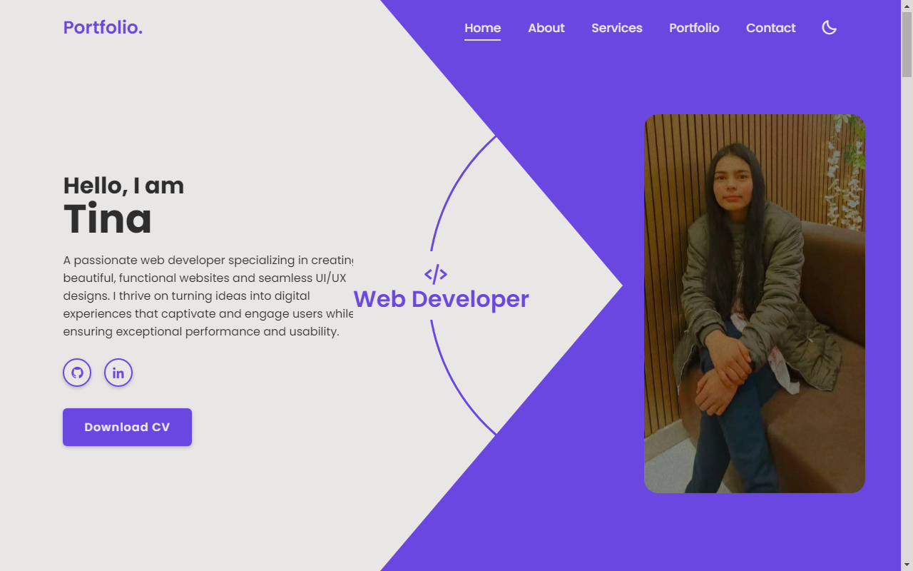

# Personal Portfolio Website

## Overview

This repository contains the source code for my personal portfolio website, showcasing my skills, projects, and accomplishments as a web developer and UI/UX designer. The site is designed to provide a visually appealing and user-friendly experience, highlighting my expertise in creating beautiful, functional websites that merge creativity with technology. Built as part of Task-04, this project demonstrates my ability to turn ideas into engaging digital experiences.

## Features

- Home Page: Captivating headline, professional photo, and a brief introduction to my passion for web development and UI/UX design. Includes social links (GitHub, LinkedIn) and a CV download button.
- About Me Section: Detailed background on my approach to web development, emphasizing collaboration, innovation, and delivering exceptional usability.
- Services: Overview of my offerings, including:
  - Web Development: Dynamic and responsive sites.
  - Graphic Design: Storytelling through visuals.
  - Digital Marketing: Effective online presence.
- Testimonials: Features a valuable endorsement from a peer, highlighting my analytical skills and dedication.
- Portfolio: Gallery of latest projects with images and descriptions (currently using placeholders like lorem ipsum for demonstration).
- Skills: Cards detailing proficiency in key technologies such as HTML, CSS, JavaScript, Node.js, React, Python, Java, C++, PHP, and SQL.
- Contact Form: Simple form for visitors to reach out, including fields for name, email, mobile, subject, and message.
- Responsive Design: Ensures seamless viewing on desktop, tablet, and mobile devices.
- Dark Mode Toggle: Moon icon in the navigation for switching themes.

## Project-Screenshot

